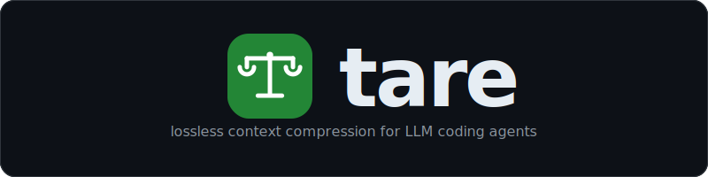
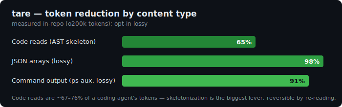

<div align="center">
  
</div>

<p align="center"><strong>lossless by default · keyword-relevance (neural opt-in) · cache-correct · closed-loop · proxy · library · CLI · MCP · local</strong></p>

<p align="center">
  <a href="https://github.com/mstuart/tare/actions/workflows/ci.yml"></a>
  <a href="LICENSE"></a>
  <a href="https://mstuart.github.io/tare/"></a>
  
  
</p>

<p align="center">
  <a href="#get-started-60-seconds">Install</a> ·
  <a href="#use-with-your-claude-subscription--mcp-no-api-key">Subscription</a> ·
  <a href="#wrap-your-agent">Wrap</a> ·
  <a href="#how-it-works-30-seconds">How it works</a> ·
  <a href="#proof">Proof</a> ·
  <a href="#compared-to">Compared to</a> ·
  <a href="#when-to-use--when-to-skip">When to use</a> ·
  <a href="#status--limitations">Status</a>
</p>

---

tare sits between an agent and the model API and shrinks the context window. Unlike most compressors
it is **lossless by default**, **cache-correct** (it never rewrites the provider's cached prefix), and
**closed-loop** — it watches the model's *output* and adapts. Opt in and it compresses aggressively:
row-capping, field-truncation, telegraphic NL, and AST code skeletonization.

> **Status: pre-1.0.** The engine is well-tested (150+ tests) and, on the included harness
> (`crates/tare-bench/`), at equal fidelity matches or beats each competitor — reproduce with the
> scripts there. It has been smoke-tested end-to-end against the live Anthropic API — through the proxy
> on a Claude subscription and via the MCP server — but it is not yet production-hardened. Read
> [Status & limitations](#status--limitations) before deploying.

## What it does

- **Proxy** — `tare-proxy`, point your agent's base URL at it; zero code changes, any language.
- **Library** — call the `tare-core` engine directly from Rust.
- **CLI** — `tare compress | slim-schema | compact-lossy | skeletonize | doctor | perf | learn | dashboard | output-savings | update | wrap | unwrap` — transforms, diagnostics, and ops.
- **MCP server** — `tare-mcp` exposes `tare_skeletonize` / `tare_compact_lossy` / `tare_compress` plus
  a reversible **`tare_expand`** (retrieve any original by id) to any MCP client.
- **Lossless by default** — re-encodes tool output, logs, and JSON into a denser *equivalent* form;
  it only drops information when you explicitly opt in.
- **Cache-correct** — detects the provider's cache breakpoint and only compresses the dynamic suffix,
  so your 90%-discount prefix cache keeps hitting.
- **Closed-loop** — watches output verbosity (the *compression paradox*), context fill, and cache
  hit-rate, and dials compression up or down per session.

## Why

- **Lossless wins where it can.** Tool output, logs, and JSON re-encode losslessly into a far denser
  form; only drop information when the caller accepts it.
- **The cache is the economy.** Provider prefix caches discount cached tokens ~10×. Perturb the
  cached prefix and a 90% discount becomes 0%. tare only ever rewrites the dynamic suffix.
- **Compression has a feedback loop.** Over-compressing makes models *compensate with verbose
  output*, so total cost can rise even as input falls. tare is the only proxy that watches output and
  backs off.

## How it works (30 seconds)

```
 Your agent / app  (Claude Code, Cursor, Codex, your own loop…)
      │  prompts · tool outputs · logs · file reads · RAG results
      ▼
  ┌──────────────────────────────────────────────────────────┐
  │  tare   (runs locally — your data and API key stay here)  │
  │  ──────────────────────────────────────────────────────  │
  │  cache-boundary detect → only touch the dynamic suffix    │
  │  lossless passes:  supersession · IVM/delta · dedup ·     │
  │                    columnar JSON/log · schema-slim ·      │
  │                    query-relevance (keyword)              │
  │  opt-in lossy:     row-cap · field-truncate · telegraphic │
  │                    · AST code skeletonization             │
  │  closed-loop controller:  cache-hit-rate (halt) ·         │
  │                    output-verbosity (back off) ·          │
  │                    context-fill (compress harder)         │
  └──────────────────────────────────────────────────────────┘
      │  compressed request                ▲  response streamed back unchanged
      ▼                                     │  (output tokens observed for the loop)
 LLM provider  (Anthropic /v1/messages · OpenAI /v1/chat/completions)
```

## Get started (60 seconds)

```bash
# 1 — install (no Rust toolchain needed)
curl -fsSL https://raw.githubusercontent.com/mstuart/tare/main/install.sh | sh   # → ~/.local/bin
# or:  npm install -g tare-ai
# or:  git clone https://github.com/mstuart/tare && cd tare && cargo build --release

# 2 — run as a proxy (point your agent's base URL at http://localhost:8787; zero code changes)
TARE_UPSTREAM=https://api.anthropic.com tare-proxy

# 3 — or use the CLI on any stdin
cat big.rs | tare skeletonize --path big.rs    # drop fn bodies, keep structure
ps aux     | tare compact-lossy --max-rows 30 --max-field 110
```

Proxy env: `TARE_UPSTREAM` (default `https://api.anthropic.com`), `TARE_PORT` (`8787`),
`TARE_RECENCY` (`4`), `TARE_ENABLED` (`true`), `TARE_CONTEXT_LIMIT` (`200000`), `TARE_OUTPUT_HOLDOUT`
(`0` — fraction of sessions that bypass compression so `output-savings` can A/B the output tokens).
Response headers report what it did: `x-tare-net-tokens`, `x-tare-dropped`, `x-tare-aggression`,
`x-tare-verbosity-spike`, `x-tare-halted`. Admin surface: `GET /admin/stats` (cumulative-savings JSON)
and `POST /admin/runtime-env` (hot-sync `TARE_ENABLED`/`TARE_RECENCY` live with no restart — send
`Content-Type: application/json`).

## Use with your Claude subscription — MCP, no API key

The proxy forwards whatever auth the client sends, so it works two ways. With a **billable API key** the
client sends `x-api-key` and the proxy passes it through. On a **Claude Pro/Max subscription** instead,
point Claude Code's `ANTHROPIC_BASE_URL` at the proxy — it forwards your subscription OAuth token
upstream, **no API key required** (`scripts/live-smoke-sub.sh` runs exactly this round-trip).

Prefer not to redirect a base URL at all? Use the MCP server: `tare-mcp` is a local stdio process your agent
launches and calls as tools — it never calls the model itself, so it needs **no API key** and rides on
whatever auth the host already has (your Claude Code `/login` subscription, or any MCP client).

```bash
# easiest — no build; npx fetches the prebuilt binary on first run:
claude mcp add tare -s user -- npx -y -p tare-ai tare-mcp

# or from a source build (user scope = every project; -s project writes .mcp.json instead):
cargo build --release -p tare-mcp
claude mcp add tare -s user "$(pwd)/target/release/tare-mcp"
```

That records a standard MCP entry. Commit it as a project `.mcp.json` to share with a repo, or paste the
same block into any other MCP client (Cursor, Codex, …):

```json
{
  "mcpServers": {
    "tare": { "command": "npx", "args": ["-y", "-p", "tare-ai", "tare-mcp"] }
  }
}
```

**Claude Desktop:** add that same `mcpServers` block to
`~/Library/Application Support/Claude/claude_desktop_config.json` (macOS) and restart.

Tools: `tare_skeletonize`, `tare_compact_lossy`, `tare_compress`, a reversible `tare_expand` (retrieve any
original by id), and `tare_stats` — JSON-RPC 2.0 over stdio (MCP protocol `2024-11-05`).

## Wrap your agent

`tare wrap <agent>` starts the proxy and launches a supported CLI agent through it in one step,
forwarding `ANTHROPIC_BASE_URL`, `OPENAI_BASE_URL`, and `OPENAI_API_BASE` to the agent process for
the duration of that invocation. Wrapping is ENV-based and ephemeral — no global state is written.

```bash
tare wrap claude               # start proxy + launch Claude Code through it
tare wrap claude -- --print    # pass extra flags to the agent (after --)
tare wrap claude --print       # dry-run: show what would run without starting anything
tare wrap claude --port 9000   # use a custom proxy port
```

**Supported agents**

| Agent | Mode | Notes |
|---|---|---|
| `claude` | auto-launch | Claude Code CLI |
| `codex` | auto-launch | OpenAI Codex CLI |
| `aider` | auto-launch | aider CLI |
| `goose` | auto-launch | Block's Goose |
| `openhands` | auto-launch | OpenHands CLI |
| `opencode` | auto-launch | opencode CLI |
| `openclaw` | auto-launch | openclaw CLI |
| `vibe` | auto-launch | Vibe CLI |
| `cursor` | manual setup | prints base-URL instructions for Cursor's settings |
| `cline` | manual setup | prints base-URL instructions for the Cline extension |
| `continue` | manual setup | prints base-URL instructions for Continue extension |
| `cortex` | manual setup | prints base-URL instructions for the Cortex library |

Auto-launch agents: the proxy starts in the background, the agent binary is exec'd with the three
env vars set, and the proxy is killed when the agent exits. Manual-setup agents: `tare wrap` prints
step-by-step instructions for pointing that tool's base-URL setting at the proxy — no binary is
launched.

`tare unwrap <agent>` prints a reminder that wrapping is ephemeral and points to where to remove
any base-URL override if it was configured directly in the agent's settings.

## Proof

<p align="center"></p>

Measured in this repo (o200k tokens), reproducible with the commands shown:

| What | Result | Reproduce |
|---|---:|---|
| **AST code skeletonization** on 31 real Rust files | **65.1%** smaller (57,199 → 19,988) | `tare skeletonize --path <f>` |
| **`ps aux`** vs RTK at equal fidelity (same rows + columns) | **~4.5% smaller**, 5/5 trials | `ps aux \| tare compact-lossy --max-rows 30 --max-field 110` |
| **Lossless** JSON / log columnar re-encode | smaller, **byte-recoverable** | `tare compress` |

Code reads are ~67–76% of a coding agent's tokens ([SWE-Pruner, ACL 2026](https://arxiv.org/abs/2601.16746)),
so skeletonization is the single biggest lever. Competitive head-to-head harnesses (vs Headroom,
LLMLingua-2, lean-ctx, RTK) live in `crates/tare-bench/benchmarks/` — run the scripts there to reproduce;
at **equal fidelity** tare matches or beats each, and is the only one with a lossless mode and cross-turn dedup.

## Compared to

tare runs **locally**, is **lossless by default**, is **cache-correct**, and **closes the loop** on
output — none of the others do all four.

|  | Scope | Deploy | Local | Lossless default | Output-aware |
|---|---|---|:-:|:-:|:-:|
| **tare** | tools · logs · files · JSON · history | proxy · library · CLI · MCP | ✅ | ✅ | ✅ |
| [Headroom](https://github.com/chopratejas/headroom) | all context | proxy · lib · MCP | ✅ | ❌ (reversible via cache) | ❌ |
| [RTK](https://github.com/rtk-ai/rtk) | CLI command outputs | CLI wrapper | ✅ | ❌ | ❌ |
| [lean-ctx](https://github.com/yvgude/lean-ctx) | CLI commands, MCP tools | CLI · MCP | ✅ | ❌ | ❌ |
| LLMLingua-2 | prose / RAG | library (ML model) | ✅ | ❌ | ❌ |
| OpenAI / Anthropic native compaction | conversation history | provider-native | ❌ | ❌ | ❌ |

## When to use · When to skip

**Great fit if you…**
- run coding agents and want savings without losing information by default
- care about the provider cache staying warm (tare won't break the prefix)
- want code reads compressed structurally (signatures kept, bodies elidable on demand)

**Skip it if you…**
- only use a single provider's native compaction and don't need a cross-provider proxy
- run in a sandbox where a local proxy process can't run

<details>
<summary><b>What's inside</b></summary>

- **Lossless passes** — supersession (drop superseded tool outputs), IVM/delta (re-reads → diffs),
  envelope + exact dedup, columnar JSON & log re-encoding, JSON-Schema slimming, reasoning-trace
  pruning, query-relevance pruning (keyword/symbol-based by default; neural embeddings opt-in via the `neural-embed` feature).
- **Opt-in lossy** — large-array row-capping, per-line field truncation, token-level telegraphic NL
  compaction, **AST code skeletonization** (tree-sitter: rust/python/js/ts/go/java/c/c++/perl).
- **Closed-loop controller** — per-session aggression from cache-hit-rate, output-verbosity, and
  context-fill signals; cache-prefix-boundary aware; bounded body buffering and upstream timeouts.

</details>

## Architecture

| Crate | Role |
|---|---|
| `tare-core` | the compression engine: segmenter, passes, planner, lossless + lossy transforms, skeletonizer |
| `tare-tokenize` | fast approximate token counter (chars/4) |
| `tare-cache` | provider cache models / hit-rate floors |
| `tare-proxy` | the HTTP proxy + closed-loop controller + sensors |
| `tare-cli` | the `tare` command |
| `tare-mcp` | MCP (stdio) server: compression tools + a reversible `tare_expand` |
| `tare-bench` | competitive benchmarks (not published) |

## Cargo features

| Feature | Default | Description |
|---|:-:|---|
| `neural-embed` | off | Semantic relevance via [fastembed](https://github.com/Anyscale/fastembed-rs). Replaces the default keyword/symbol relevance pass with **exact cosine ranking** over neural embeddings — no HNSW index, no approximate search. Downloads an embedding model on first use. |

The default build uses **keyword/symbol matching** for query-relevance pruning and has no external model dependency. Enable semantic relevance with:

```bash
cargo build --release --features neural-embed   # downloads an embedding model on first use
```

> Exact cosine is used (not HNSW or any approximate index) because at relevance-pass scale — a handful of candidate segments per turn — exact ranking is faster and strictly more accurate than approximate nearest-neighbour.

## Diagnostics & tuning

```bash
# Health check — engine self-test, tokenizer sanity, config, proxy probe, learned-profile status.
# Exits non-zero if any check fails.
tare doctor

# Measure compression savings and speed on a built-in sample corpus.
tare perf --sample

# Offline corpus analysis — reads files under ./logs, derives compression settings,
# and writes ~/.config/tare/profile.json.  The proxy auto-loads this file on startup.
# (Not online RL: learn analyses static files and produces a persisted profile.)
tare learn --from ./logs

# Live savings dashboard (polls the proxy's /admin/stats); --once prints a single snapshot.
tare dashboard

# Estimate OUTPUT-token reduction via an A/B holdout (run the proxy with TARE_OUTPUT_HOLDOUT=0.1).
tare output-savings

# Self-upgrade to the latest GitHub release (--check only reports, never modifies).
tare update --check
```

## Status & limitations

- **v0.1.0** is tagged and published as a GitHub release; **not yet on crates.io** — build from source
  or `cargo install --git` for now.
- **Live-smoke-tested, not production-hardened** — one full round-trip through `tare-proxy` against the
  live Anthropic API on a Claude subscription (`scripts/live-smoke-sub.sh`), plus the MCP server driven
  over real stdio JSON-RPC, on top of 150+ unit, integration, and property tests against mock upstreams. Not yet load- or
  hostile-input-tested in production.
- Startup failures (HTTP client build, port bind, serve) exit with a clear `[tare-proxy] fatal: …`
  message and a non-zero status rather than a panic backtrace.
- The context-fill signal counts the serialized request (incl. JSON envelope), so it slightly
  over-estimates true fill (conservative — errs toward compressing sooner).
- A `>2 MB` *streaming* response whose final usage event straddles the 64 KB tail buffer may skip one
  verbosity sample (non-fatal).

## Contributing

See [CONTRIBUTING.md](CONTRIBUTING.md). CI runs `cargo fmt --check`, `cargo clippy -D warnings`,
`cargo test`, and a release build — please make sure those pass locally.

## License

MIT — see [LICENSE](LICENSE).
